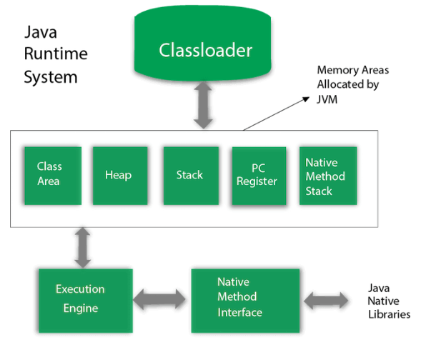
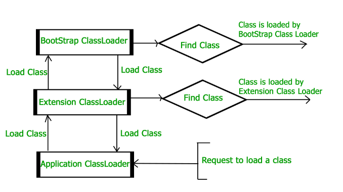

# What is JVM 



> It's a software specification. It means as long as you meet the criteria, whatever you use, you can call it JVM.  

1. The specification: *To implement the Java virtual machine correctly, you need only be able to read the `class` file format and correctly perform the operations specified therein.* 

Since this specification is liberal enough, there are a lot of implementations provided by Oracle, Amazon, and etc.

2. Implementation: Its implementation is known as Java Runtime Environment (JRE)

	- OpenJDK *HotSpot*: most thoroughly tried-and-tested codebases
	- *GraalVM*: high performance and support for non-JVM languages e.g. C++ and Rust
	- Domain-specific: *robotics JVM, LeJOS*

3. Runtime Instance: When starts a Java program, JVM is created.

# What JVM does? Loads and execute class files

JVM depends on the Java classloader and execution engine.

## Classloader

JVM depends on *Classloader* to load compiled `.class` files into context. 

When in terminal `java Hello.class`, it starts a JVM and load the named class into it.

*Classloader* loads the classes into memory and makes them available for execution.

*Classloader* use techniques like lazy-loading and caching to make loading efficient.

### Built-in Classloader

Class hierarchy: `Boostrap <- Extension <- System/Application`

1. Bootstrap Classloader: loads the `rt.jar` file which contains all class files of Java SE e.g. java.lang, java.util.
2. Extension Classloader: loads the jar files located inside `$JAVA_HOME/jre/lib/ext`
3. System/Application Classloader: loads the classfiles from classpath. Set by `-cp` or `-classpath`. By default, it's the current directory.


See the example below:
```java
// String class is loaded by bootstrap loader, and
// bootstrap loader is not Java object, hence null
System.out.println(String.class.getClassLoader());

// We create a custom class. 
// it is loaded by Application loader
System.out.println(Test.class.getClassLoader());
```

### Classloader will create a `class` object

Get the `class` from 2 objects and compare them. They're the same class, with the same reference, hash code.
```java
People p1 = new People("John", 12);
People p2 = new People("Mary", 22);

Class c1 = p1.getClass();
Class c2 = p2.getClass();

System.out.println(c1.equals(c2)); // true
System.out.println(c1 == c2);   // true
```

### Classloader loading hierarchy

> JVM follows the Delegation-Hierarchy principle to load classes.

1. System class loader delegate load request to extension classloader 
2. Extension classloader delegate request to the bootstrap classloader

If a class found in the boot-strap path, the class is loaded

If not:
1. request again transfers to the extension classloader.

2. then to the system classloader. 

At last, if the system class loader fails to load class, then we get run-time exception `java.lang.ClassNotFoundException`. 



## Execution engine

After *classes are loaded by Classloader*, execution engine starts to execute the code.

Execute the code requires the *access to OS resources*. JVM is the middleman between:
- file
- network
- memory resources
- OS

Execution engine is responsible for taking something like the `new` keyword, and turning it into an OS-specific request for memory allocation.

Beyond memory, the execution engine manages resources for file system access and network I/O.

Execution engine is responsive to:
- OS environment
- Application resource needs

That is how the JVM handles in-the-wild demands.

## Java Native interface (JNI)

Java Native Interface (JNI) is a framework which provides an interface to communicate with another application written in another language like C, C++, Assembly etc. Java uses JNI framework to send output to the Console or interact with OS libraries.


# Reference 
- https://www.infoworld.com/article/3272244/what-is-the-jvm-introducing-the-java-virtual-machine.html
- https://www.javatpoint.com/jvm-java-virtual-machine
