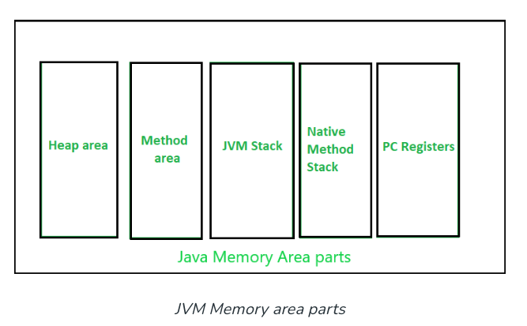

# Why learn memory management?

> Automatic garbage collection doesn’t guarantee everything. If we don’t know how the memory management works, often we will end up amidst things that are not managed by JVM (Java Virtual Machine). There are some objects that aren’t eligible for the automatic garbage collection.

Knowing the memory management is essential as it will benefit the programmer to write high performance based programs that will not crash, or if does so, the programmer will know how to debug or overcome the crashes.

# The major concepts in Java memory management

- JVM memory structure
- Working of Garbage collector

# Java memory structure


When Java program starts, it defines memory areas.

Some define by JVM. Some are created by the threads.

- Memory area created by JVM will be destroyed only when JVM exits.
- Memory created by thread will be destroyed when threads exits.

## Heap

- Instantiate when VM startup
- One heap only
- Shared runtime data area and stores the actual object.
- JVM provide the user control to vary the *size of heap*. 
- When a new keyword is used, object is assigned a space in heap, but the reference of the same exists onto the stack.

```
Car myCar = new Car();
```
It creates an object of `Car`. The object is allocated to heap, the reference `myCar` gets pushed to the stack.

> *Note*: GC in heap area is mandatory.

## Method area

- A logical part of the heap area. 
- Created when VM startup
- Memory is allocated for 
	- class structures (names, superclass)
	- Type's modifier
	- method data  
	- constructor field data
	- interfaces
	- special method in class
 - The memory for method area needs not to be continuous

> *Note*: Though method area is part of heap, it *may or may not be garbage collected* even if GC is compulsory in heap.

## JVM stacks

- Created when a thread is created
- Store data and partial results which will be needed while returning value for method and performing dynamic linking
- Size can be fixed or dynamic
- The memory for stack needs not to be contiguous

## Native method stacks

> Also called as C stacks, native method stacks are not written in Java language. This memory is allocated for each thread when its created. And it can be of fixed or dynamic nature.

## Program counter (PC) registers

- Each JVM thread carries out the task of a specific method has a PC register associated with it.
- Non native method has a PC. It stores the address of the available JVM instruction.
- Native method, the value of PC is undefined.
- PC register is storing the return address or a native pointer on some specific platform

# Working of Garbage Collector

- In the current scenario, all GC are generational, and hence, optimal.
- JVM triggers garbage collection automatically.

- GC process causes the rest of the processes or threads to be paused. Hence, it's costly.

## Optimize garbage collection

To optimize the GC, some will apply several garbage-collector-based algorithms. This is called Garbage Collector tuning.

Generational garbage collectors adds *age field* to the objects that are assigned a memory. As more objects are created, the list of garbage grows thereby increasing the garbage collection time. On the basis of how many clock cycles the objects have survived, objects are grouped and allocated an *age* accordingly. This way the GC work gets distributed.