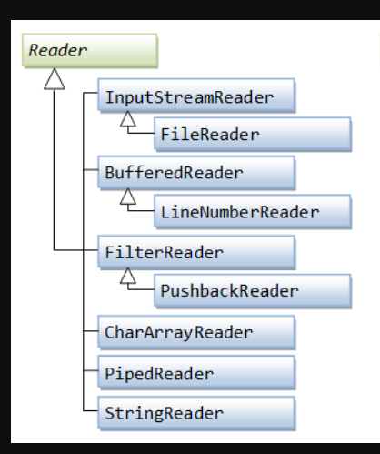

## Quick note 
To read a text file, use `FileReader` or `InputStreamReader`.

# Reader



> `java.io.Reader` is the base class for all Reader subclasses in the Java IO API. A Java Reader is like a Java `InputStream` except that it is **character based** rather than byte based. In other words, a Java Reader **is intended for reading text (characters)**, whereas an `InputStream` is intended for reading **raw bytes**.

- `Reader` for text based.
- `InputStream` for all raw data.

## Read 
### Read an int of individual char 
`Read.read()` returns an `int` that represents the `char` value instead of `byte, char`.
```java
Reader reader = new FileReader("file.txt");

int charNum = reader.read();
while(charNum != -1) {
	char aChar = (char) charNum;
	System.out.println(aChar);
	charNum = reader.read();
}
```

### Read array of char
```java
Reader reader = new FileReader("/path/to/file/thefile.txt");

char[] theChars = new char[128];

int charsRead = reader.read(theChars, 0, theChars.length);
while(charsRead != -1) {
    System.out.println(new String(theChars, 0, charsRead));
    charsRead = reader.read(theChars, 0, theChars.length);
}
```

### Close the reader after use
Either by using *try-with-resources* or explicitly calling `reader.close()`:

```java
reader.close();

// or
try (Reader reader = ...) {
	// code
}
```

`read(target, start, end)` specifies how you read to the target `char[]`.

## Performance of reading

> Reading an array of characters at a time is faster than reading a single character at a time from a Java Reader. The difference can easily be a factor 10 or more in performance increase, by reading an array of characters rather than reading a single character at a time.

## Add buffering to `Reader`

Buffering is generally faster approach to speed up array reading. You can create a `BufferedReader` by wrapping the existing `Reader` instance of `new BufferedReader()`:

```java
Reader bufferedReader = new BufferedReader(new FileReader("file.txt"), 1024*1024);
```
