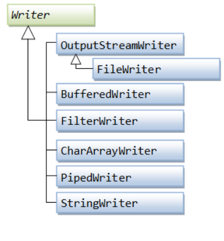

## Quick note 
- close the `Writer`. Sometimes if you don't close it, the data may not be written.

# Writer



> `java.io.Writer` is the base class for all Writer subclasses in the Java IO API. A Writer is like an `OutputStream` except that it is character based rather than byte based. In other words, a Writer is intended for writing text, whereas an `OutputStream` is intended for writing raw bytes.

- `Writer` for text based.
- `OutputStream` for all raw data.


## Write 
### Write array of char 
```java
try (Writer writer = new FileWriter("output.txt")) { 
	char[] chars = new char[]{'A', 'B', 'C', 'D', 'E'};
	writer.write(chars);
}
```

### Write string

```java
try (Writer writer = new FileWriter("output.txt")) { 
	String text = "Hello world!";
	writer.write(text);
}

```

### Close the writer after use
Either by using *try-with-resources* or explicitly calling `writer.close()`:
```java
writer.close();

// or
try(Writer writer = ...) {
	// code
}
```

## Performance of writing 
> It is faster to write an array of characters to a Java Writer than writing one character at a time. The speedup can be quite significant - up to 10 x higher or more. Therefore it is recommended to use the `write(char[])` methods whenever possible.

## Add buffering to `Writer`

Buffering is generally faster approach to speed up array writing. You can create a `BufferedWriter` by wrapping the existing `Writer` instance of `new BufferedWriter()`:

```java
Writer bufferedWriter = new BufferedWriter(new FileWriter("file.txt"), 1024*1024);
```