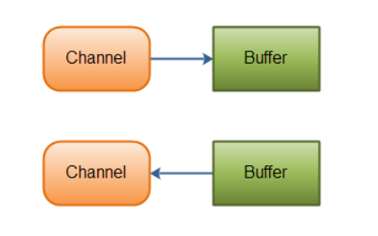
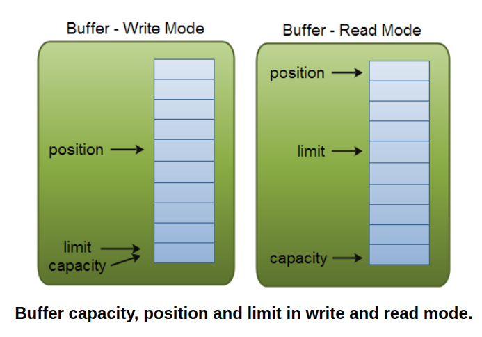
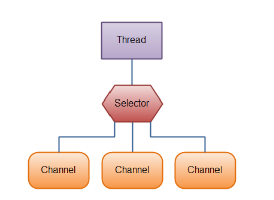

There are many classes in Java.nio package, however, Java NIO make up of 3 core components:
- Chnnels
- Buffers
- Selectors

## Channels and Buffers relationship

All nio manipulations start with a `Channel`. It works like a stream. You make use a channel, and transmit the data into `Buffer`.
Vise versa; when you want to write to a file, you send the data from the `Buffer`, through the `Channel` to the file. Illustrated below:




## Channel

> you read data from a channel into a buffer, and write data from a buffer into a channel.

There are 4 main `Channel` implementations:
- `FileChannel` - of file
- `DatagramChannel` - of network via UDP
- `SocketChannel` - of network via TCP
- `ServerSocketChannel` - listen for incoming TCP connections like a web server.

### `Channel` vs `Stream`

- Stream is one-direction while channel can be bidirection
- Channels can read and write asynchronously
- Channels always read to, or write from, a buffer

## Buffer 

> Buffers, a memory block, are used when interacting with NIO Channels. As you know, data is read from channels into buffers, and written from buffers into channels.

There are several `Buffer` implementations :
- `ByteBuffer`
- `CharBuffer`
- `IntBuffer`
- `DoubleBuffer`
- `FloatBuffer`
- `ShortBuffer`
- `LongBuffer`
- `MappedByteBuffer`

### methods

- `buffer.flip()` - flip the `Buffer`, so you can print it to the console or whichever manipulation you want
- `buffer.clear()` - clear entire buffer
- `buffer.compact()` - clear the used data, unused data is pushed to the front.

#### buffer use example

1. create channel 
2. create buffer 
1. read from channel to buffer
3. manipulate data in buffer
	- read data 
	- flip to write side, print to console
	- clear the buffer 

```java
try (RandomAccessFile file = new RandomAccessFile("file.txt", "rw")) {
	FileChannel inChannel = file.getChannel();

	ByteBuffer buffer = ByteBuffer.allocate(48);

	int byteRead = inChannel.read(buffer);
	while (byteRead != -1) {
		buffer.flip();

		while(buffer.hasRemaining()) {
			System.out.print((char) buffer.get());
		}

		buffer.clear();
		byteRead = inChannel.read(buffer);

	}

} catch (IOException e) {
	throw new RuntimeException(e);
}

```

### `Buffer` under the hood

**This section will explain more buffer manipulation and low lever concepts. The above section is enough for most use case** 

#### Buffer properties
Properties of `Buffer`: 
- capacity - how large the buffer can contain. Fixed value
- position - work as the *index*, point to where you read or write to next
- limit - the limit amount of data you can read or write from buffer

Illustrated below:


#### Allocating a `Buffer`
```java
ByteBuffer buffer = ByteBuffer.allocate(bytes);

// allocate 1024 bytes for CharBuffer
CharBuffer buffer = CharByteBuffer.allocate(1024);
```
#### Write data to a `Buffer`
- Write from a Channel into a `Buffer`
- Write into `Buffer` yourself by `put()`
```java
int byteRead = inChannel.read(buffer); // write to buffer

// or yourself write it
buffer.put(127);
```

#### `flip()` - make the buffer able to read to your program

> The `flip()` method switches a `Buffer` from writing mode to reading mode. Calling `flip()` sets the position back to 0, and sets the limit to where position just was.

Besides, when you `int byteRead = inChannel.read(buffer);` The `Buffer` automatically becomes write mode.

#### Read `Buffer` data

```java
int byteRead = inChannel.read(buffer);

// read to byte and convert to char
byte aByte = buffer.get();
char aChar = (char) aByte;

// from here, we can print to console or whichever manipulation you want to perform
```

#### Clear the buffer by `clear()` or `compact()`

##### `clear()` reset the position to 0 to overwrite the existing data
> When call `clear()`, you set the position of buffer to 0, and the limit to the capacity e.g. 48 bytes possibly. From there you write the data from channel into `Buffer`. In other words, you *overwrite* the data, not *clear it and write it.*

##### `compact()` - keep the unread data and ready to write new data into `Buffer`

> When there is unread data, you can call `compact()`. It will make the `Buffer` available to be written data from `Channel`. The new data will be kept behind the unread data. 

For example, a 48-byte capacity buffer, there are 48-byte data in it. We read 20 bytes but move to other operation. Now call `compact()`, we erase 20 bytes, and move the remaining 28 bytes to the front of buffer, and make the Buffer available to be written more data from Channel.
Now the buffer only has 28 more bytes space available, and the new data will be written from there.

## Selectors 

[text](https://jenkov.com/tutorials/java-nio/selectors.html)

A `Selector` allows a single thread to handle multiple Channels. Illustrated below:



