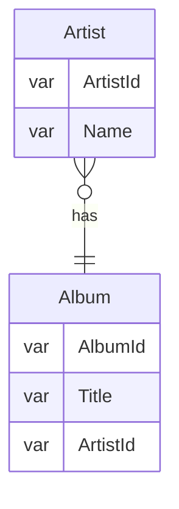
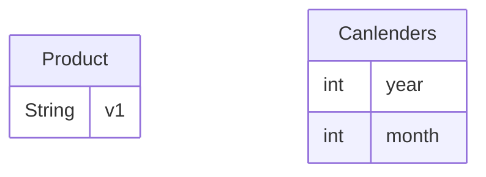

[toc]

 

## Connect
```bash
sqlite3
```

## Exit sqlite3
```
sqlite>.exit
```

### Connect a database when start the CLI
```bash
sqlite3 /path/to/*.db
```

## Open a file in cli
```bash
sqlite> .open /path/to/*.db
```

## Help
```bash
.help
```

## Show database at current connection
```
.database
```

## Add/Attach an additional database in the current connection
```
sqlite> ATTACH DATABASE "/path/to/*.db" AS theNameYouWant;
```

## Show tables
```
.tables
```

Find tables based on a pattern. E.g. ends with `es`
```
sqlite> .table '%es'
employees genres invoices media_types
```

## Show the structure of a table
If omit `TABLE`, display all tables
```
.schema TABLE
```

Example, see the albums schema
```
sqlite> .schema albums
CREATE TABLE "albums"
(
    [AlbumId] INTEGER PRIMARY KEY AUTOINCREMENT NOT NULL,
    [Title] NVARCHAR(160)  NOT NULL,
    [ArtistId] INTEGER  NOT NULL,
    FOREIGN KEY ([ArtistId]) REFERENCES "artists" ([ArtistId])
                ON DELETE NO ACTION ON UPDATE NO ACTION
);
CREATE INDEX [IFK_AlbumArtistId] ON "albums" ([ArtistId]);
```

## Show indexes
If omit `TABLE`, display all
```
.indexes TABLE
```

## Save the result of a query into a file
Save the subsequent queries to `FILENAME`
```
sqlite> .output albums.txt
sqlite> SELECT title FROM albums;
```

**Only save the one following query:** 
```
sqlite>.once FILENAME
```

## Execute SQL statements from a file
file `commands.txt`
```
SELECT albumid, title
FROM albums
ORDER BY title
LIMIT 10;
```

Execute the command from the file
```
sqlite> .mode column    // show column style
sqlite> .header on      // show header
sqlite> .read ./commands.txt

// records
```

## SQL 

### SELECT
use `*` to select all. *Avoid `*`, because if someone add/remove a column from the SQLite, there'll be a problem.* 
```
SELECT
    trackid,
    name,
    composer
FROM
    tracks;
```

### Order By - Sort
```
SELECT
    column_one,
    column_two
FROM
    TABLE
ORDER BY
    column_two ASC,
    column_one DESC;
```

Or simplify by the column order. This makes the data **ORDER BY** column_two ASC first, then column_one.
```
SELECT
    column_one,
    column_two
FROM
    TABLE
ORDER BY
    2, 1;
```

#### ORDER NULL
The default is **NULLS first** 
```
SELECT trackid FROM tracks ORDER BY Composer;
```
 

**Or specify that you want `NullS last`** 
```
SELECT trackid FROM tracks ORDER BY Composer Nulls Last;
```

### WHERE condition
```
SELECT
	column_list
FROM
	table
WHERE
	search_condition;
```

#### Comparison Operator
| Operator | Meaning                  |
|----------|--------------------------|
| =        | Equal to                 |
| <> or != | Not equal to             |
| <        | Less than                |
| >        | Greater than             |
| <=       | Less than or equal to    |
| >=       | Greater than or equal to |

#### Logical Operator

> A logical operator returns 1, 0, or a NULL value. Notice that SQLite does not provide Boolean data type therefore 1 means TRUE, and 0 means FALSE.

| Operator | Meaning                                       |
|----------|-----------------------------------------------|
| ALL      | returns 1 if all expressions are 1            |
| AND      | returns 1 if both are 1                       |
| OR       | returns true if either expression is 1        |
| ANY      | returns 1 if any of a set of comparisons is 1 |
| BETWEEN  | returns 1 if a value if within range          |
| EXISTS   | returns 1 if a subquery contains any rows     |
| IN       | returns 1 if a value is in a list of values   |
| LIKE     | returns 1 if a value matches a pattern        |
| NOT      | reverse the value                             |

#### WHERE condition example
Example 1: simple condition
```
SELECT 
    name,
    milliseconds,
    bytes,
    albumid
FROM
    tracks
WHERE 
    albumid = 1;
```
 

---

Example 2: `AND`
```
SELECT
	name,
	milliseconds,
	bytes,
	albumid
FROM
	tracks
WHERE
	albumid = 1
AND milliseconds > 250000;
```
 

---

Example 3: `pattern LIKE`
```
SELECT
	name,
	albumid,
	composer
FROM
	tracks
WHERE
	composer LIKE '%Smith%'
ORDER BY
	albumid;
```
   

---

Example 4: `IN` - to group the value
```
SELECT
	name,
	albumid,
	mediatypeid
FROM
	tracks
WHERE
	mediatypeid IN (2, 3);
```
 

### LIMIT - select n rows
```
SELECT
	column_list
FROM
	table
LIMIT row_count;
```

If you want to get the 11th~20th rows, use `LIMIT row_count OFFSET offset`
```
SELECT
	column_list
FROM
	table
LIMIT row_count OFFSET offset;
```
Alternatively:
```
SELECT
	column_list
FROM
	table
LIMIT offset, row_count;
```

Limit Example 1: from 11 to 20
```
SELECT
    trackId,
    name
FROM
    tracks
LIMIT 10 OFFSET 10;
```
 


### BETWEEN - in WHERE condition
`BETWEEN a_expression AND b_expression`

- Use `BETWEEN` to specify the value range. E.g. `WHERE price BETWEEN 10 and 20`

- Use `NOT BETWEEN` to negate the result

Example:
```
SELECT
    InvoiceId,
    BillingAddress,
    Total
FROM
    invoices
WHERE
    Total BETWEEN 14.91 and 18.86    
ORDER BY
    Total; 
```
Output:

 

---

#### BETWEEN date example
```
SELECT
    InvoiceId,
    BillingAddress,
    InvoiceDate,
    Total
FROM
    invoices
WHERE
    InvoiceDate BETWEEN '2010-01-01' AND '2010-01-31'
ORDER BY
    InvoiceDate;
```

### IN used for condition - 
> operator to determine whether a value matches any value in a list or a subquery

- `NOT` can combine with IN - `WHERE in NOT IN (1, 2, 3);`

Example 1: use `IN` to replace `condition_1 = A OR condition_2 = B`
```
SELECT
	TrackId,
	Name,
	Mediatypeid
FROM
	Tracks
WHERE
    // instead of 'MediaTypeId = 1 OR MediaTypeId = 2'
	MediaTypeId IN (1, 2)   
ORDER BY
	Name ASC;
```

---

Use for subquery:
Example2
```
SELECT
	TrackId, 
	Name, 
	AlbumId
FROM
	Tracks
WHERE
	AlbumId IN (
		SELECT
			AlbumId
		FROM
			Albums
		WHERE
			ArtistId = 12
	);
```
 

- First, the subquery returns a list of album ids that belong to the artist id 12.
- Then, the outer query return all tracks whose album id matches with the album id list returned by the subquery.

### LIKE for pattern search
> Note that it's case-insensitive. If want to make it sensitive, set the statement.
Wildcards:
- `%` - zero or more characters. E.g. %per% - percent
- `_` - any single character

```
SELECT
	column_list
FROM
	table_name
WHERE
	column_1 LIKE pattern;
```

Example 1:
```
SELECT
	trackid,
	name
FROM
	tracks
WHERE
	name LIKE '%Wild'
```
 

#### Escape the wildcards
Where the `'\'` after `ESCAPE` used as the escape character, you can use others like `/ @ $`
```
column_1 LIKE '%10\%%' ESCAPE '\';
```

It will match:
```
10% increase
```

### GLOB for a string search by `UNIX-pattern`

- `*` - any number of characters
- `?` - for one single character
- `[]` - to specify the range. E.g. `[a-zA-Z0-9]` to allow all, or `[xyz]` only allow x, y, z.
- `^` - to eliminate/exclude the target. E.g. `[^0-9]` exclude numeric 

Example 1:
```
SELECT
	trackid,
	name
FROM
	tracks
WHERE
	name GLOB '*Man';
```
 

---

Example 2:
```
SELECT
	trackid,
	name
FROM
	tracks
WHERE
	name GLOB '*[^1-9]*';
```
 

### IS NULL - to find null row
`NULL = NULL` **This always evaluates to false, cuz unknown can't be compared.** 

In order to find the `NULL` record, use `IS NULL`. Vise versa, use `IS NOT NULL`.

Example 1:
```
SELECT
    Name, 
    Composer
FROM
    tracks
WHERE
    Composer IS NULL
ORDER BY 
    Name;   
```
 

### JOIN

You can use:
- `INNER JOIN`
- `LEFT JOIN`
- `CROSS JOIN`

**Note that SQLite doesn't support `RIGHT JOIN`, `FULL OUTER JOIN`** 

An artist can have zero or many albums while an album belongs to one artist.


#### Inner join
```sql
SELECT 
    Title,
    Name
FROM 
    albums
INNER JOIN artists 
    ON artists.ArtistId = albums.ArtistId;
```
 

**If share the same name: `USING()` is in use**
```sql
SELECT
    Title,
    Name
FROM
    albums
INNER JOIN artists USING(ArtistId);
```
It's equipvalent to `ON artists.ArtistId = albums.ArtistId.`

#### LEFT JOIN
*Note that `LEFT JOIN` and `LEFT OUTER JOIN` are synonyms.* 
Left join will **returns all rows from the left,** and match rows from the right table on condition you specify. 

E.g. the example below (artists.ArtistId = albums.ArtistId)
```sql
SELECT
    Name, 
    Title
FROM
    artists
LEFT JOIN albums ON
    artists.ArtistId = albums.ArtistId
ORDER BY Name;
```
 

SQLite includes columns of the rows in the left table and `NULL` for the columns of the right table.

Alternatively, you can use `USING`:
```sql
SELECT
   Name, 
   Title
FROM
   artists
LEFT JOIN albums USING (ArtistId)
ORDER BY
   Name;
```

#### CROSS JOIN
It creates a Cartesian product of rows from the joined tables. If table_a has n rows, while table_b has m rows, the result will have `nXm` rows.

It doesn't have **join condition.**

```sql
SELECT
    select_list
FROM table1
CROSS JOIN table2;
```

For example, an e-commerce store has a `Product` and `Canlenders` table


We have 3 rows in `Product`: `v1, v2, v3`, `Canlenders`: `2019, 1` to `2019, 12`

```sql
SELECT * 
FROM products
CROSS JOIN calendars;
```
Output:

 
