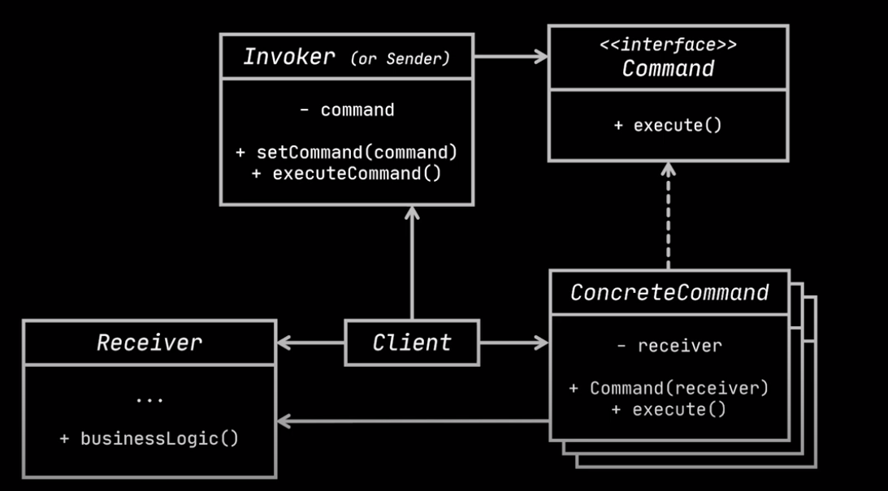

[Youtube](https://www.youtube.com/watch?v=UfGD60BYzPM) 

## Real world example
> We have a house consists of many rooms, i.e. living room, bedroom, and bathroom. Each room has a light, and its switch. We want to add a sensor to the light so it'll turn on automatically when there's a person in the room. 

Room:
```java
public class Room {
    private Light light;
}
```

Subclasses, i.e. living room
```java
public class livingRoom extends Room{

}
```

> After a while we found that we don't need the auto sensor in bathroom, it's annoying that the light will turn off automatically. But the `bathroom` class is not the base class. How? Furthermore, we also buy a lamp, and this lamp wants the functionality as well.

*It's difficult to add new functionality to the base class `Room`. Besides, the lamp itself is not a room either.* 

## Command design pattern

 

We implement the command design pattern which: **We create an interface `command`, it has a single method `execute`.** For functionality, we implement this interface. 

The `SwitchLightsCommand` class take cares of the command logic. And the `Room` class now has the instance variable `command` and 2 methods: `setCommand(), executeCommand()` which client can use lambda to create the desired instance of class and execute.

```java
Room livingRoom = new livingRoom();
livingRoom.setCommand(new SwitchLightsCommand(new Light()));
livingRoom.executeCommand();
```


