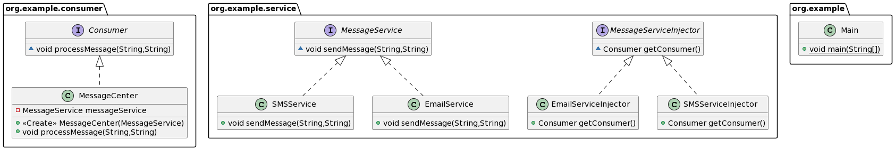

> Java Dependency Injection design pattern allows us to remove the hard-coded dependencies and make our application loosely coupled, extendable and maintainable. We can implement dependency injection in java to move the dependency resolution from compile-time to runtime.

We're going to create an message service as an example.

## Without Dependency injection pattern

Without the pattern the code will look like this.

Email service
```java
public class EmailService {
	public void sendEmail(){
		log.info("Send mail");
	}
}
```

Service center
```java
public class ServiceCenter {

	private EmailService email = new EmailService();
	
	public void processMessages(){
		this.email.sendEmail();
	}
}
```

Application
```java
public class Application {
    public static void main(String[] args) {
        ServiceCenter sc = new ServiceCenter();
        sc.processMessages();
    }
}
```

It doesn't seem wrong. But **it has limitation.** 

- `ServiceCenter` class is responsible to initialize the email service and then use it. This leads to hard-coded dependency. If we want to switch to some other advanced email service in the future, it will require code changes in the class
- Hard to extend - suppose we want to add SMS or Facebook message, we'll have to create another `ServiceCenter`.
- Cannot mock the `EmailService` object for testing purpose. It's because we create the instance directly in the `ServiceCenter` class.

One can say that we can remove the `EmailService` initialization from `ServiceCenter` class by having a constructor that receives the `EmailService` object as an argument. 

However, **we're asking client applications or test classes to initializing the `EmailService`.** It's not a good design decision.

## Dependency Injection

1. **Program to interface.** Services e.g. Email, SMS, etc, should be designed with base class or interface. It’s better to prefer interfaces or abstract classes that would define contract for the services.
2. Consumer classes should be implemented in terms of Service center.
3. Injector classes will initialize the services and consumer class.

Message service interface, make the EmailService implements it.
```java
public interface MessageService {
	void sendMessage();
}
```

Consumer interface, make ServiceCenter implements it.
```java
public interface Consumer {
    void processMessages();
}
```

ServiceCenter implementation
```java
public class ServiceCenter implements Consumer{

	private MessageService service;
	
	public ServiceCenter(MessageService svc){
		this.service=svc;
	}
	
	@Override
	public void processMessages(){
		this.service.sendMessage();
	}

}
```

Lastly Dependency injection classes
```java
public interface MessageServiceInjector {
	public Consumer getConsumer();
}
```

For EmailService
```java
public class EmailServiceInjector implements MessageServiceInjector {
	@Override
	public Consumer getConsumer() {
		return new ServiceCenter(new EmailServiceImpl());
	}
}
```

And the client code:
```java
public static void main(String[] args) {
    String msg = "Hi Pankaj";
    String email = "pankaj@abc.com";
    String phone = "4088888888";
    MessageServiceInjector injector = null;
    Consumer app = null;
    
    //Send email
    injector = new EmailServiceInjector();
    app = injector.getConsumer();
    app.processMessages(msg, email);
    
    //Send SMS if we create the classes
    injector = new SMSServiceInjector();
    app = injector.getConsumer();
    app.processMessages(msg, phone);
}
```

Our application class is responsible only for using the service. Service classes are created in injectors. Also if we have to further extend our application to allow facebook messaging, we will have to write Service classes and injector classes only.


**Class Diagram** 
 
