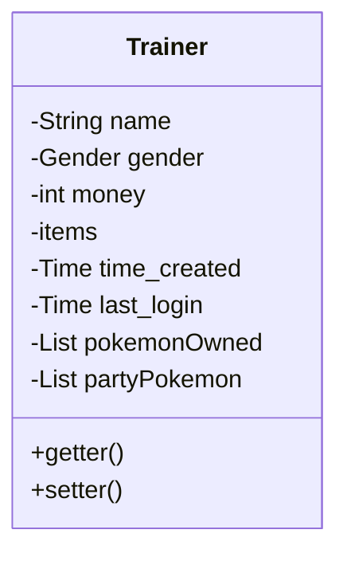
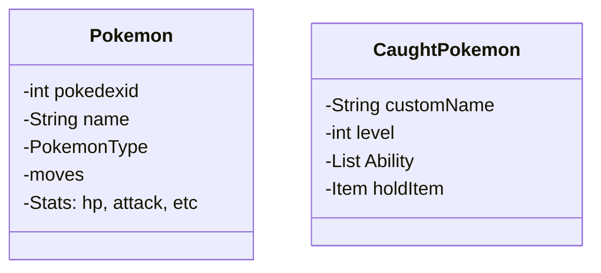

## todo

- [ ] add pokemon evolution tree

## known bug

After saving PokemonType by PokemonTypeEntity to database, the PokemonType id always decrements by 1. However, if read back to application, the Pokemon has the correct type. This might due to enum class oridnal.

## Database design

### Trainer class

A trainer have money, items, name, time created, last time login, gender

A trainer can have many pokemons

A party can have at most 6 ones.

### Pokemon class

A pokemon can learn many moves, but at a time, it can only have 4 abilities.

### Item class

A trainer can have Item#1 of amount 6.

| trainer_id | item_id | amount |
|------------|---------|--------|
| 1          | 3       | 5      |
| 2          | 45      | 1      |
