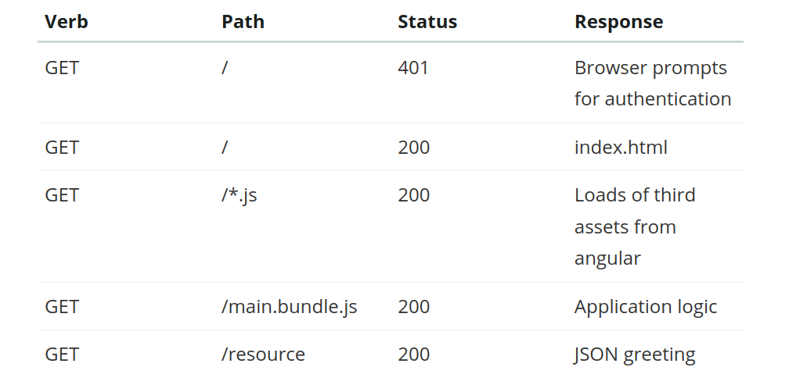
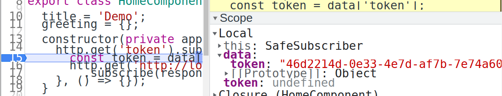
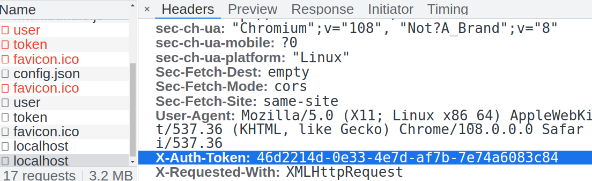

[spring boot with angular js](https://spring.io/guides/tutorials/spring-security-and-angular-js/#using-the-initializr-website)

further study:
what is proxy? proxy authentication ?


## part1 - browser login panel

in java main class, only the main method and the one endpoint. We do not setup any security method. But `spring-security` will by default secure every endpoint.

There are a lot of authentication methods.

- Basic 
- Bearer
- Digest
- HOBA
- Mutual
- etc.

We use HTTP Basic authentication here. Most browsers support Basic auth. It will prompt dialog for user to type in username and password.

[source](https://spring.io/guides/tutorials/spring-security-and-angular-js/#how-does-it-work)


1. Before login
2~5. after login 

Request headers have `Authorization`

dependency `spring-security` is securing the endpoint by default

## part 2

###  - login panel

[user and resources need more to do](https://spring.io/guides/tutorials/spring-security-and-angular-js/#_adding_default_http_request_headers)
Before auth, the `app.service` has sent request to the backend, ask for `/user`. 
`home.components.ts` when construct, also sent request to `/resource` to get data.

But without auth, it sends back `401 unautherized`.

So the browser prompts a login panel.

### logout

## Part 3

### separate server

1. We removed the `requestmapping` "/resource" from the UIApplication class.  
2. Create a new module `resource`. the port number is 9000. with a springboot application 
3. The AngularJS called `http.get('http://localhost:9000')` to get the resource. 

We separate the server, and we open `http://localhost:8080` and login. The text is blank. We can't get any data from port 9000! 
When we open the developer debugging, it shows: it's **blocked by CORS policy**. 

In annotation `http://localhost:8080`, **DO NOT** add the last '/', because it won't work then!

### Token
```javascript
  constructor(private app: AppService, private http: HttpClient) {
    http.get('token').subscribe(data => {
      const token = data['token'];
      http.get('http://localhost:9000', {headers : new HttpHeaders().set('X-Auth-Token', token)})
        .subscribe(response => this.greeting = response);
    }, () => {});
  }
```

In this constructor, there is a nested call `http.get(http.get())`, first get the `token` data from the 8080, then pass that as argument to 9000 to get the response.

Before login, we call it once. It returns `Unautherized`, then we login. After login, we get the token and send *GET* to 9000.


How spring session knows to use redis?
See `application.yml`, spring.session.store-type: redis





> In case of 'x-auth-token' user has to supply username/password for the first time and server returns a access-token in header field 'x-auth-token'. For further sessions this token is exchanged, not the username/password.