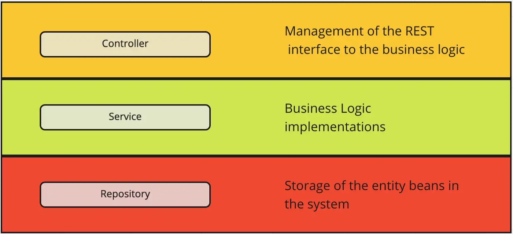

[toc]

# Spring RESTful service

[Laur Spilca Youtube Tutorial series](https://www.youtube.com/watch?v=VE_NRRxc2lw&list=PLEocw3gLFc8Vli5p6rWHnNcYxFRbaIfIJ&index=16) 

[spring docs](https://docs.spring.io/spring-framework/docs/3.0.0.M4/reference/html/ch15s03.html)

Spring Restful service is a popular backend application. The architecture usually is made up with 3 layers: Controller, Service, and Repository.


## Configuration setup

### `@SpringBootApplication` - define the app root

- The start point of program
- It's with `@ComponentScan` - tell spring to create beans in which the classes have been annotated with.

## Spring RESTful Service architecture



Spring RESTful service usually has this architecture.
- Controller - Responsible for exposing the API to the external consumer. E.g., In web service, it's the endpoint. like `POST /user/create`. 
- Service - A layer that conduct business logic. It's also the layer that talks to the repository.
- Repository - The layer that talks to database. This defines how to perform CRUD to database.

### `@Controller`, `RestController` - Controller exposes API

> This annotation serves as a specialization of `@Component`, allowing for implementation classes to be auto-detected through component scanning. 

TL;DR
- `@RestController` - it combines `@Controller` and `@ResponseBody`.
- `@Controller` is a stereotype annotation
- `@ResponseBody` tells spring that instead of finding the static web templates, e.g. thymeleaf or JSP, response the content in this method/class directly.
- `@PathVariable` - to specify a variable url, e.g. `/api/{userId}`

#### Request
It is typically used in combination with annotated handler methods based on the `@Controller` and `@RequestMapping`.

Furthermore, use `@RestController` as the shorthand of `@Controller` and `@RequestMapping`


##### `@RequestMapping` - the parent of mapping annotation

> Used to annotate either the class or methods for URLs.

- Class-level - for specific request path 
- method level -  for a specific HTTP method request ("GET"/"POST") or specific HTTP request parameters.

`@RequestMapping()` can use `path` or `value` to map. See *Spring alias*
```java
@Controller 
@RequestMapping("/api")
public class WebController {

	@RequestMapping(method = RequestMethod.GET, path = "/hello")
	public String hello() {
	    return "Hello World!";
	}

	@RequestMapping(method = RequestMethod.POST, path = "/create")
	public String create() {
		return new Object();
	}

}
```
Class-level makes the entire mapping to `/api`. So that when clients want to call `hello()`, the url path is `GET /api/hello`.
Method-level maps a specific *path*, and a particular HTTP methods.

---
Another example
```java
@Controller
public class WebController {
	@RequestMapping(method = RequestMethod.GET, path = "/hello")
	public String hello() {
	    return "Hello World!";
	}
}
```
No class-level `@RequestMapping`, therefore the path for this method is `http://hostname.com/hello`

###### `@GetMapping`, `@PostMapping`, etc, shorthands

- `@GetMapping`
- `@PostMapping`
- `@PutMapping`
- `@DeleteMapping` 
- `@PatchMapping`

Boiler template codes can be shorter:
```java
// from
@RequestMapping(method = RequestMethod.GET, path = "/hello")
// to
@GetMapping(path = "/hello")
```

##### `@RequestMapping` quick example with path, header, body, and response

You can access everything in the method

```java
@PostMapping(path = "/test/{name}")
public String test(@PathVariable("name") String name,
                    @RequestHeader String a,
                    @RequestHeader String b,
                    @RequestHeader String c,
                    @RequestBody    String body,
                    HttpServletResponse reponse) {
    response.setStatus(HttpServletResponse.SC_NO_CONTENT);
    return a + b + c + body + name;
}
```

#####  `@PathVariable` - URI templates

> indicate that a method parameter should be bound to the value of a URI template variable.

**Note that** the parameter name should match the URI variable.
```java
@RequestMapping(method = RequestMethod.GET, path = "/hello/{name}")
public String hello(@PathVariable("name") String name) {
    return "Hello " + name + "!";
}
```
Multiple parameters 
```java
@RequestMapping(method = RequestMethod.GET, path = "/hello/{firstname}/{familyname}")
public String hello(@PathVariable("firstName") String firstName, 
				   @PathVariable("familyName") String familyName) {
    return "Hello " + firstName + " " + familyName + "!";
}
```

Class-level `GET /owners/{ownerId}/pets/{petId}`
```java
@Controller
@RequestMapping("/owners/{ownerId}")
public class RelativePathUriTemplateController {

  @RequestMapping("/pets/{petId}")
  public void findPet(@PathVariable String ownerId, @PathVariable String petId, Model model) {    
    // implementation omitted
  }
}
```

> Method parameters that are decorated with the `@PathVariable` annotation can be of **any simple type** such as int, long, Date... This can be customized through [WebDataBinder](https://docs.spring.io/spring-framework/docs/3.0.0.M4/reference/html/ch15s03.html#mvc-ann-webdatabinder)


##### `@RequestParam` - access the params of `/api?key=value`

[spring request param](https://www.baeldung.com/spring-request-param)

>  Extract query parameters, form parameters, and even files from the request.

Attributes
- value, alias "name" - name of param
- defaultValue - give a default value
- required - Method parameters annotated with `@RequestParam` are required by default. Set to *false* means otherwise.

###### Example 1: basic use
```java
@GetMapping("/api/foos")
@ResponseBody
public String getFoos(@RequestParam String id) {
    return "ID: " + id;
}
```
```bash
GET localhost:8080/api/foos?id=123
---
<Response 200> ID: 123
```

###### Example 2: different param name
```java
@PostMapping("/api/foos")
@ResponseBody
public String addFoo(@RequestParam(name = "id") String fooId) { 
    return "ID: " + fooId;
}
```
```bash
GET localhost:8080/api/foos?id=123
---
<Response 200> ID: 123
```

###### Example 3: Set optional parameters
```java
@GetMapping("/api/foos")
@ResponseBody
public String getFoos(@RequestParam(required = false) String id) { 
    return "ID: " + id;
}
```
With parameter
```bash
GET localhost:8080/api/foos?id=abc
----
ID: abc
```
Without parameter
```bash
http://localhost:8080/spring-mvc-basics/api/foos
----
ID: null
```
Hence, wrap it with `Optional` will be better:
```java
@GetMapping("/api/foos")
@ResponseBody
public String getFoos(@RequestParam Optional<String> id){
    return "ID: " + id.orElseGet(() -> "not provided");
}
```
```bash
GET http://localhost:8080/api/foos 
---- 
ID: not provided
```

###### Example 4: Use map to capture all
```java
@PostMapping("/api/foos")
@ResponseBody
public String updateFoos(@RequestParam Map<String,String> allParams) {
    return "Parameters are " + allParams.entrySet();
}
```
```bash
curl -X POST -F 'name=abc' -F 'id=123' http://localhost:8080/api/foos
-----
Parameters are {[name=abc], [id=123]}
```

###### Example 5: array like value
```java
@GetMapping("/api/foos")
@ResponseBody
public String getFoos(@RequestParam List<String> id) {
    return "IDs are " + id;
}
```
```bash
GET http://localhost:8080/api/foos?id=1,2,3
----
IDs are [1,2,3]
### AND
http://localhost:8080/api/foos?id=1&id=2
----
IDs are [1,2]
```

##### `@RequestBody` - JSON unmarshal the request to object

**There's no "request body" in GET method.** Only in other request methods, there's body.

> Spring `@RequestBody` annotation maps the `HttpRequest` body to a transfer or domain object, enabling automatic deserialization of the inbound `HttpRequest` body onto a Java object. It's assuming an appropriate one is specified.

Commonly, developers will use the `ClassForm` to transit the input request.

```java
public class PersonForm {
    private String name;
    private int age;
    // constructor, getters and setters
}
```

```java
@PostMapping(path = "/goodbye")
public String goodbye(@RequestBody PsersonForm p) {
    return "Goodbye, " + p.getName() + "!";
}
```
Request:
```bash
POST http://localhost:8080/goodbye/

BODY:
{ "name" : "Bill" }
---
Goodbye, Bill!
```

###### Setting the response content type

> explicitly set the response content type in `@RequestMapping(produce = type)`

- `produces = MediaType.APPLICATION_JSON_VALUE)`
- `produces = MediaType.APPLICATION_XML_VALUE)`

Example, respond with XML
```java
@PostMapping(value = "/content", produces = MediaType.APPLICATION_XML_VALUE)
@ResponseBody
public ResponseTransfer postResponseXmlContent(
  @RequestBody LoginForm loginForm) {
    return new ResponseTransfer("XML Content!");
}
```
```bash
# Request:
curl -i \
-H "Accept: application/xml" \
-H "Content-Type:application/json" \
-X POST --data
  '{"username": "johnny", "password": "password"}' \
  "https://localhost:8080/content"

# Response:
HTTP/1.1 200
Content-Type: application/xml
Transfer-Encoding: chunked
Date: Thu, 20 Feb 2020 19:43:19 GMT

<ResponseTransfer><text>XML Content!</text></ResponseTransfer>
```

##### `@RequestHeader` - access the headers

> The `@RequestHeader` allows a method parameter to be bound to a request header.

```java
@RequestMapping("/headerInfo")
public void getHeaderInfo(@RequestHeader("Accept-Encoding") String encoding,
                          @RequestHeader("Keep-Alive") long keepAlive)  {
  //...
}
```


#### Response and `@ResponseBody`

`@ResponseBody` tells spring that instead of finding the static web templates, e.g. thymeleaf or JSP, response the content in this method/class directly.

> `byte[], image, set, map, etc` can be returned. Spring will automatically marshal it.

##### Return an object
```java
@GetMapping(path = "/get")
public Person goodbye() {
    Person p = new Person("Bill");
    return p;
}
```
Output:
```
{ "name" : "Bill" }
```

##### Return a List
```java
@GetMapping(path = "/getall")
public List<Person> goodbye() {
    Person p1 = new Person("Bill");
    Person p2 = new Person("John");
    return Arrays.asList(p1, p2);
}
```
Output:
```
[
    {
        "name" : "Bill"
    },
    {
        "name" : "John"
    }
]
```

##### Return a Map
```java
@GetMapping
public Map<String, String> all(@RequestHeader Map<String, String> map) {
    return map;
}
```

#### Set the HttpServletResponse status

We can set the status by this, Spring framework will take care of it.
You can also return a body if you wish.
```java
@GetMapping(path = "/status")
public void statusTest(HttpServletResponse reponse) {
    // set the status you preferred
    response.setStatus(HttpServletResponse.SC_NO_CONTENT);
}
```

### `@Service` - stereotype annotation for business logic

> Taking care of business logic. It performs the manipulation of an entity, an object, or a desired behaviour.

make use of:
- `@Transactional` - in service layer, a logic might perform multiple database transaction. Use this for ACID.

Common example:
```java
@Service
public class CarService {
    
    private final CarRepository repository;
    //  ...
    public Car findCarById(long carId) {
        return repository.findById(carId)
                         .orElseThrow(() -> new CarNotFoundException(carId));
    }

}
```

### `@Repository` - stereotype annotation for interaction with data persistence

> The best way to guarantee that your Data Access Objects (DAOs) or repositories provide exception translation is to use the `@Repository` annotation. This annotation also allows the component scanning support to find and configure your DAOs and repositories without having to provide XML configuration entries for them.


```java
@Repository
public class SomeMovieFinder implements MovieFinder {
    // ...
}
```

One very common is to combine with *Spring Data JPA*:
```java
@Repository
public interface CarRepository extends JpaRepository<Car, Long> {
    // ...
}
```
